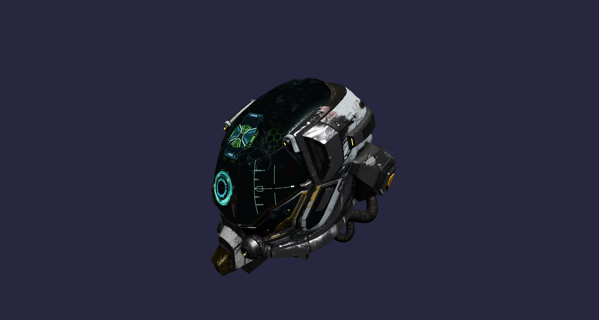
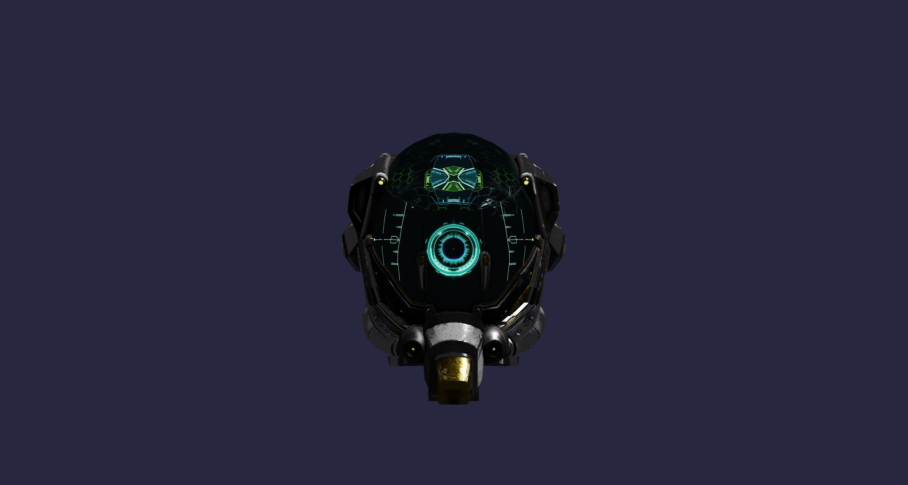

# Enigma

A C++26 Vulkan 1.3 rendering engine built from scratch.




## What it does

Loads glTF 2.0 scenes and renders them with a Cook-Torrance PBR pipeline. Metallic-roughness workflow, normal mapping, ACES tone mapping, reverse-Z depth. The DamagedHelmet above uses five 2048px texture channels loaded straight from the .glb.

Materials are stored in a single bindless SSBO. The shader indexes into it by material index rather than receiving texture slots through push constants. Vertices follow the same pattern, packed into storage buffers and accessed bindlessly.

## Stack

- Vulkan 1.3 with dynamic rendering (no VkRenderPass or VkFramebuffer)
- HLSL shaders compiled at runtime via DXC to SPIR-V, with hot-reload on file change
- Bindless global descriptor set covering textures, samplers, and SSBOs
- fastgltf for SIMD-accelerated glTF 2.0 parsing
- VulkanMemoryAllocator for GPU memory
- C++26 on MSVC (/std:c++latest)

External deps (volk, VMA, GLFW, GLM, fastgltf, stb_image) are fetched automatically via CMake FetchContent.

## Building

Requirements: Windows 10/11, CMake 3.28+, Vulkan SDK 1.3+, MSVC 17.10+

```sh
cmake -S . -B cmake-build-debug -G "NMake Makefiles"
cmake --build cmake-build-debug --target Enigma
```

The build copies shaders and assets next to the executable.

## Layout

```
src/
  core/       Types, Assert, Log, Paths
  platform/   Window (GLFW)
  input/      Keyboard and mouse
  engine/     Engine, Application, Clock
  gfx/        Instance, Device, Allocator, Swapchain, FrameContext,
              DescriptorAllocator, ShaderManager, ShaderHotReload,
              Pipeline, UploadContext, Validation
  renderer/   Renderer, MeshPass, TrianglePass
  scene/      Scene, Camera, CameraController, Transform
  asset/      GltfLoader
shaders/
  mesh.hlsl       PBR vertex + fragment
  triangle.hlsl   Fallback debug pass
```

## Notes

Bindless from the start. Everything that could be a descriptor is a slot in the global array. The material system is where this pays off most visibly.

No render passes. Dynamic rendering keeps the frame loop simple.
